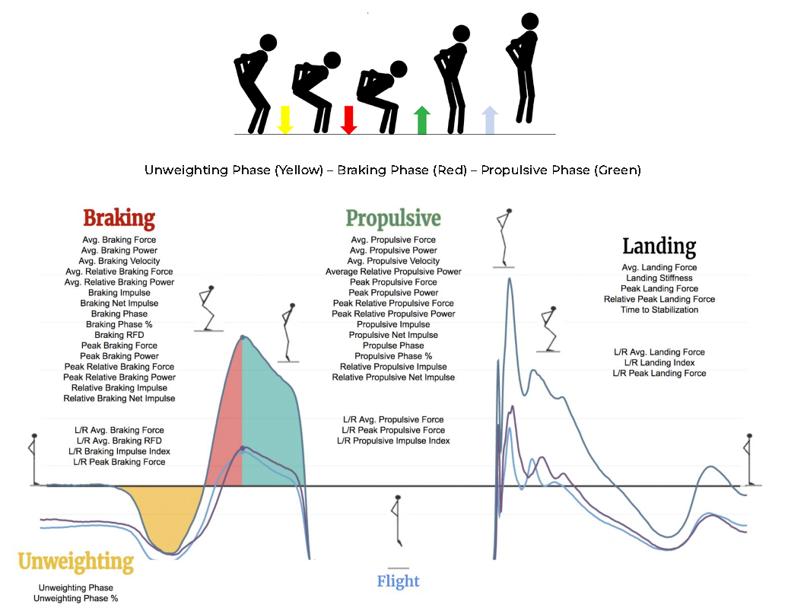

The [Hawkin Dynamics Metric Database](https://www.hawkindynamics.com/hawkin-metric-database) was referenced to support understanding of the data and its interpretation.

```{r setup, include=FALSE}
knitr::knit_hooks$set(purl = knitr::hook_purl)
knitr::opts_chunk$set(echo = TRUE)
```
### __*Setup*__

```{r prep, echo = T, results = 'hide', warning=F, message=F}
# SET UP WORKSPACE, LOAD PACKAGES & DATA ----------------------------------------------------
# load general use packages using pacman
if (!require("pacman")) install.packages("pacman", INSTALL_opts = "--no-multiarch")
pacman::p_load(tidyverse, here, janitor, skimr, ggpubr, data.table, install = TRUE)

# set working directory
here()
wd <- here()

# create folder structure
for(df in c('code', 'data_files', 'output')){
  if(!exists(df))
  dir.create(path = paste0(wd, "/", df))
}

# load data
cmj_raw <- data.table::fread(here("data_files/CMJ_data.csv"))
```
### __*First Pass*__

The commands used for the initial steps of data review are shown below with data tables suppressed for the sake of brevity and cleanliness of the report.

```{r data clean, echo = T, results = 'hide'}
# INITIAL DATA REVIEW -----------------------------------------------------

# convert date from char to date as new variable
cmj_raw$date <- as.Date(cmj_raw$Date)
cmj_raw$month <- month(cmj_raw$date)

# overall snapshot of the data
cmj_raw %>%  skimr::skim() # 6 missing values for MetricValue

# ID rows with missing data
cmj_raw[!complete.cases(cmj_raw)] # All from Player1 on 2022-06-16

# metric values distributions
x <- cmj_raw %>% group_by(MetricName) %>% skim(MetricValue) %>% select(-numeric.hist)

print(x, include_summary = FALSE)
```
```{r cmj frequency}
# when/how many times did each player perform CMJ
cmj_raw %>% dplyr::group_by(Player) %>% skimr::skim(date) %>% 
  select(-c(skim_variable, n_missing, complete_rate, Date.median))

cmj_raw %>% dplyr::group_by(Player) %>% skimr::skim(testid) %>% 
  select(-c(n_missing, complete_rate, character.min, character.max, character.empty, character.whitespace))

```
### *__Initial impressions__*

* Very little missingness seen in the dataset - 6 rows out of `r nrow(cmj_raw)`, of which all were from Player 1 data.

* Player data was collected between `r min(cmj_raw$date)` and `r max(cmj_raw$date)`

* Player 1 had the least amount of data, having 7 tests performed on 2 dates. 
  + Player 1's data profile is unlike the other players in the sample in terms of sample size. Between this and the dates of assessment, it *could* indicate this player is new to the team (assuming this data is from a single team), via trade or call-up. Another thought is that Player 1 is returning from an injury and is being evaluated as part of their return to play process.

* Player 3 had the most amount of data, with 161 tests performed on 54 dates. 

* Players had multiple test IDs for a given evaluation date. Disparate IDs were often time stamped with the same datetime. This ID indicate where a [tag was applied](https://learning.hawkindynamics.com/knowledge/what-are-tags-and-when-should-i-use-them) to indicate that a test condition may have been altered (ex: hand placement changes for performing the movement). For the purposes of this project, we will treat all data by player/date as a single condition even if there was an alteration in task.

### __*Data Exploration Approach*__

While there are many variables that are part of a CMJ evaluation output, we will focus attention on side-to-side limb asymmetries. Like other CMJ components, variations of limb asymmetries could portend to an [increased injury risk](https://pubmed.ncbi.nlm.nih.gov/33009354/). Understanding these possible asymmetries within the context of the Braking, Propulsive, and Landing phases of the CMJ could help identify athletes who may require additional training or evaluation to mitigate injury risk or maximise performance.



### __*Player Asymmetry*__

Below are the initial visualizations of each of the CMJ variables associated with asymmetry by each of the aforementioned CMJ phases. These variables are:

	
* L|R Peak Force(%)	
* L|R Avg. Force(%)	
* L|R Avg. RFD(%)	
* L|R Impulse Index(%)	


#### Boxplots
```{r asymmetry boxplots}
cats <- c("Braking", "Landing", "Propulsive")

for(i in cats){
  print(ggboxplot(cmj_raw %>% 
          filter(str_detect(MetricName, i) & str_detect(MetricName, "\\|")), x = "MetricName", y = "MetricValue", color = "Player") + 
    theme(axis.text.x = element_text(angle = 45, hjust = 1)) + 
    geom_hline(yintercept=c(0), linetype='dashed', color=c('red')) +
  labs(title = paste0(i, " Asymmetry Vals")))
}
```

#### Player-specific CMJ Asymmetry Values

Numeric asymmetry data are provided in the tables below for reference
```{r asymmetry player avgs}
cats <- c("Braking", "Landing", "Propulsive")

for(i in cats){
x <- cmj_raw %>% filter(str_detect(MetricName, i) & str_detect(MetricName, "\\|")) %>% 
  group_by(Player, MetricName) %>% skim(MetricValue) %>% select(-c(skim_type, skim_variable, n_missing, complete_rate, numeric.p25, numeric.p50, numeric.hist))

print(x, include_summary = FALSE)
}
```

### __*Ad Hoc Future Analysis Directions*__

Some player-specific trends are starting to appear broadly using this limited portion of the data. Extending ever so briefly into further areas to pursue towards further delineation and description of these players are to look at time series-level results and to pull in other metrics that have been used across multiple are of sports injury research. Here, we get a glimpse of L/R Landing Impulse Index across month and modified Reactive Strength Index across month. Landing Impulse Index was selected due to Player 3's values being so disparate in comparison to the others in the sample and mRSI due to its ability to assess athlete performance readiness on a general level.

```{r monthly data, echo = T, warning=FALSE, message=FALSE}
ggboxplot(cmj_raw %>% filter(MetricName == "L|R Landing Impulse Index(%)"), x = "month", y = "MetricValue", color = "Player", add = "jitter") + theme(axis.text.x = element_text(angle = 45, hjust = 1)) + labs(title = paste0("Asymmetry - Landing Impulse - Monthly"))


ggboxplot(cmj_raw %>% filter(MetricName == "mRSI"), x = "month", y = "MetricValue", color = "Player", add = "jitter") + theme(axis.text.x = element_text(angle = 45, hjust = 1)) + labs(title = paste0("mRSI - Monthly"))


```

### __*Player Asymmetry Takeaways*__

In this brief, high-level review of the data, we see that Player 3 displays substantial asymmetries across many of the selected CMJ metrics in comparison to the other players. In particular, Player 3's metric values are predominantly positive values, indicative of the left dominance. This characteristic holds fairly constant across the 3 CMJ phase of interest, which could indicate a unique characteristic of the athlete more so than a harbinger of injury. This player also has the highest mRSI values in comparison to their cohort, showing perhaps that these asymmetries are not hindering reaction time or ability to quickly generate power and recover. Last, Player 3 shows some variability in the impulse measure taken across month. July appeared to be a highly variable month in this metric - it's this time of the season where an extended break is in high demand - but they did return to high levels of impulse performance for the second half of their season.